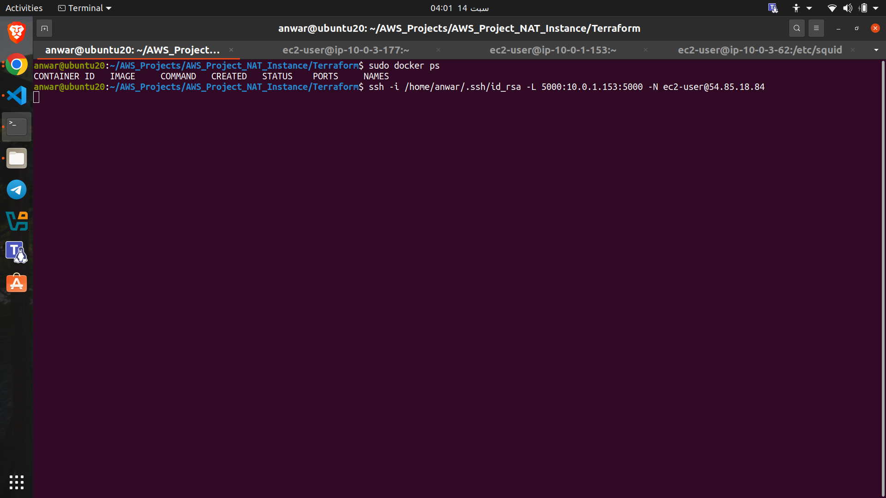
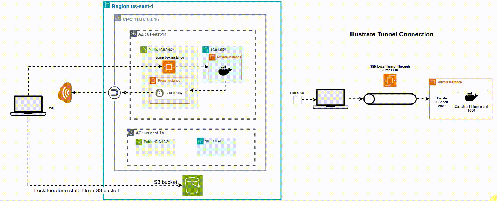

# AWS Multi-AZ VPC with Proxy and Jump Box

## Author
**Ahmed Mohamed Anwar Ibrahim**  
GitHub: [AhmedMohamedAnwar](https://github.com/AhmedMohamedAnwar)  

---

## Architecture

This project demonstrates a multi-AZ AWS network architecture with public and private subnets, Proxy servers, and a jump box for secure access. The setup ensures **high availability** and **disaster recovery**.

### VPC & Subnets
- **VPC:** Single VPC hosting all resources.  
- **Public Subnets (2 AZs):**
  - AZ1: `10.0.3.0/24`  
  - AZ2: `10.0.4.0/24`  
  - Hosts **2 EC2 instances**:  
    - **Proxy server** (Squid)  
    - **Jump box** for accessing private instances
- **Private Subnets (2 AZs):**
  - AZ1: `10.0.1.0/24`  
  - AZ2: `10.0.2.0/24`  
  - Hosts **1 private EC2 instance** with internet access only via proxy.

### Routing & Internet Access
- **Internet Gateway (IGW)** attached to the VPC.  
- **Public Route Table** associated with public subnets for outbound internet access.  
- **Private Subnets** access the internet only through the proxy server (Squid) in public subnets.

### EC2 Instances
- **Public EC2 (Proxy Server 1)**: Handles HTTP/HTTPS requests from private EC2.  
- **Public EC2 (Jump Box)**: SSH access point to private EC2.  
- **Private EC2**: Isolated from direct internet access, uses proxy for updates and external access.

### Security
- Security Groups allow:
  - SSH from your public IP to Jump Box & Proxy EC2.
  - TCP 3128 from private subnet to Proxy server.
- Network ACLs configured to allow ephemeral ports and proxy traffic.

### State Management
- Terraform **state file stored in S3** with **state locking enabled** for safe multi-user collaboration.

---

## Proxy Server Configuration (Amazon Linux AMI)

### Install Squid and Authentication Tools
```bash
sudo yum update -y
sudo yum install -y squid apache2-utils httpd-tools
```
### Create Proxy User
```bash
sudo htpasswd -c /etc/squid/passwords <username>
```
### Edit Squid Configuration
```bash
sudo vi /etc/squid/squid.conf
```
### Add the Following Lines


```bash
# Authentication
auth_param basic program /usr/lib64/squid/basic_ncsa_auth /etc/squid/passwords
auth_param basic realm proxy
auth_param basic credentialsttl 2 hours
auth_param basic casesensitive off

# Access Control
acl authenticated proxy_auth REQUIRED
http_access allow authenticated safe_ports
http_access allow authenticated SSL_ports

# Recommended minimum Access Permission configuration
http_access deny !Safe_ports
http_access deny CONNECT !SSL_ports

# Only allow cachemgr access from localhost
http_access allow localhost manager
http_access deny manager

# Listen on port 3128
http_port 3128
```
### Restart Squid and Verify
```bash
sudo systemctl restart squid.service
sudo netstat -tulnp | grep 3128   # Check listening port
sudo tail -f /var/log/squid/access.log
```
### Configuring Private Instance 
### Configure yum to Use Proxy
#### Edit /etc/yum.conf and add:
```bash
sudo vim /etc/yum.conf
```
```bash
proxy=http://<username>:<password>@<proxy_server_private_IP>:3128

```
### Export Environment Variables for HTTP/HTTPS
```bash
export http_proxy="http://<username>:<password>@<proxy_server_private_IP>:3128"
export https_proxy="http://<username>:<password>@<proxy_server_private_IP>:3128"

```

## Deployed a Docker container and established an SSH tunnel for secure remote access
### Know more about Image and code [Flasker App](https://github.com/AhmedMohamedAnwar/flask-docker-app)
```bash
sudo docker run -d --name flasker_app -p 5000:5000 -v my_vol:/app ahmedmanwar/flasker-app-2:v1.0

``` 

### Open ssh tunnel trougth jump box server
```bash

ssh -i key.pem -L port_of_yourlocal:private_EC2:port_of_private EC2 -N ec2-user@jump_box_ip
```
#### My real project example
```bash
ssh -i /home/anwar/.ssh/id_rsa -L 5000:10.0.1.153:5000 -N ec2-user@54.85.18.84
```
### Opened Tunnel

### Reult on port 5000

### Private EC2 can not ping "ICMP" but Can curl "HTTP" google 

### Illustration gif 



